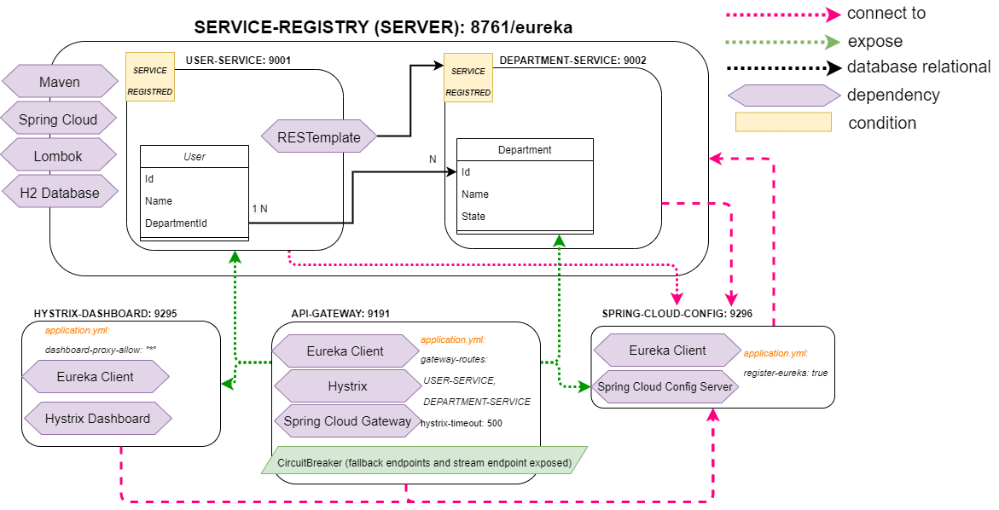

# SpringBoot Microservices with Eureka and API Gateway - Worshop DailyCodeBuffer

This code and projects are based on a tutorial from [Microservices using SpringBoot | Full Example](https://youtu.be/BnknNTN8icw)

# Project Structure

## Architecture and Programming Dependencies:
- Maven
- Spring Cloud
- Lombok (code reduction)
- H2 Database

### Server

#### ServiceRegistry
- Eureka Server

### Microservices

#### API Gateway
- Eureka Client
- Hystrix
- Spring Cloud Gateway
- CircuitBreaker (fallback endpoints and stream endpoint for Hystrix)

#### Spring Cloud Config
- Eureka Client
- Spring Cloud Config Server
- [Remote Repository with the Config File](https://github.com/devwdougherty/config-server-dailycodebuffer-workshop)

#### UserService
- Eureka Registred
- RestTemplate (LoadBalanced)

#### DepartmentService
- Eureka Registred

#### HystrixDashboard
- Eureka Client
- Hystrix Dashboard

# Solution Architecture Diagram

